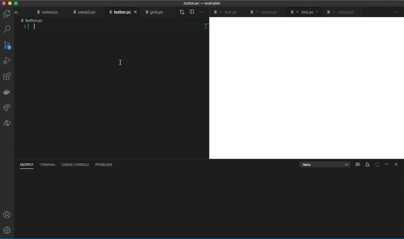
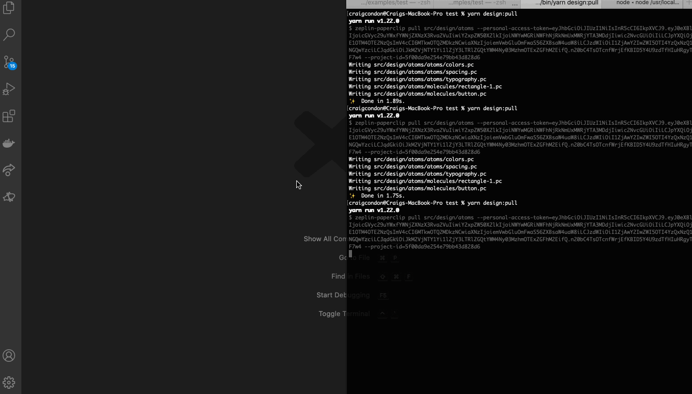

<div>
  <a href="https://circleci.com/gh/crcn/paperclip/tree/master"></a>
  <a href="https://github.com/crcn/paperclip/blob/master/MIT-LICENSE.txt"></a>
</div>


Paperclip is a language for building UI primitives. Here's an Example:

```html

<!-- Styles are scoped to this document, so you don't have to worry about them leaking out  -->
<style> 
  .button {
    font-family: Helvetica;
    display: inline-block;
    border-radius: 10px;
    padding: 10px 20px;
    color: #FFF;
    background: rgb(51, 51, 51);
    &.secondary {
      color: #333;
      border: 1px solid #333;
      background: transparent;
    }
  }
</style>

<!-- This component is compiled to code -->
<div export component as="Button" class:secondary class="button">
  {children}
</div>

<Button>
  This is a primary button
</Button>

<Button secondary>
  This is a secondary button
</Button>
```

☝🏻 Not much else to this. Here's how you use it in React (using Webpack or CLI tool):

```typescript
import {Button} from "./button.pc";

export SomeForm = () => {
  return <>
    <Button>
      This is a primary button
    </Button>
    <Button secondary>
      This is a secondary button
    </Button>
  </>;
};
```

> ☝🏻 Currently React is the only compiler target, but more are planned. 

## Why use Paperclip?


### Covers most of your UI

Paperclip covers most UI cases, and provides a format for declaring them in a clear & consise way (and quickly via the realtime preview). For cases where you need more complex styling behavior, Paperclip provides APIs that help you achieve that. 

### Compiles to plain performant code

No interpreters or runtimes. Paperclip UIs compile directly to your target framework (currently only React for Alpha, more targets planned later). 

### Scoped styling

Styles in Paperclip are scoped to the documents they're defined in, so you don't have to worry about style collisions. 

### Sass-like syntax out of the box

Mixins, nested rules, and other sass-like features work out of the box. 

### Faster development

No more switching back and forth between the browser & code. Paperclip comes with a [VS Code extension](https://marketplace.visualstudio.com/items?itemName=crcn.paperclip-vscode-extension)  that allows you to preview UIs in realtime. 

<!--  -->




### Visual regression testing

Just run `percy-paperclip` to do visual regression testing across all of your application's visual states that are defined in Paperclip UI. Worry less about CSS bugs reaching production.


### Perfect for design systems

Paperclip makes it easy to set up & document design systems that are discoverable, and re-usable. 


### Synchronizes with Zeplin

Use the zeplin-paperclip tool to automatically download design tokens and component styles to your project. 



### Strongly typed

Paperclip's CLI tool generates TypeScript definition files so that you can safely include Paperclip UIs in your project. Here's an example:

```typescript
/* eslint-disable */
import {ReactNode, ReactElement} from "react";

type Factory<TProps> = (props: TProps) => ReactElement;

export declare const classNames: {
  "app": string,
  "app-container": string,
  "todoapp": string,
  "new-todo": string,
  "toggle-all": string,
  "info": string,
  "todo-list": string,
  "main": string,
};

type Props = {
  onNewTodoKeyPress: Function,
  items: ReactNode,
  controls: ReactNode,
};

declare const View: Factory<Props>;
export default View;
```

### Roadmap

Here's a peak at what's planned for Paperclip:

- Multiple compiler targets so that you can re-use your Paperclip UIs in different languages & frameworks
- Extension for Atom, Sublime, and other editors
- Remote UI preview that you can use across devises & browsers (such as BrowserStack).
- Storybook integration
- UI editor controls:
  - CSS animation editor
  - various editors for colors, box shadows, filters, etc
- A11Y
- Code splitting so that you don't need to include all of your CSS into one bundle
- IDE intellisense

## Resources

- [VS Code extension](https://marketplace.visualstudio.com/items?itemName=crcn.paperclip-vscode-extension)
- [Getting started](./documentation/Getting%20Started)
- [Syntax](./documentation/Syntax)
- Integrations
  - [React](./packages/paperclip-compiler-react)
  - [Webpack](./packages/paperclip-loader)
- Examples
  - [React TodoMVC](./examples/react-todomvc)
