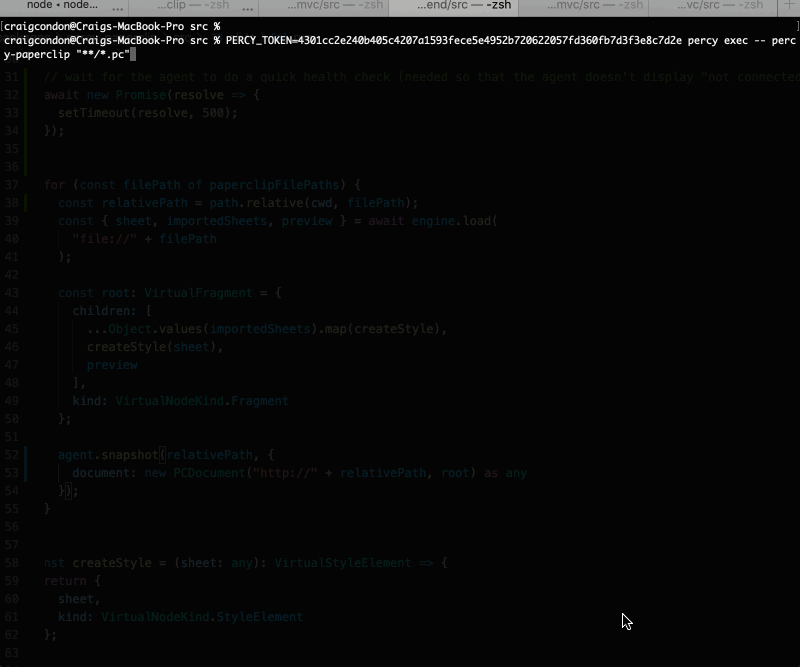
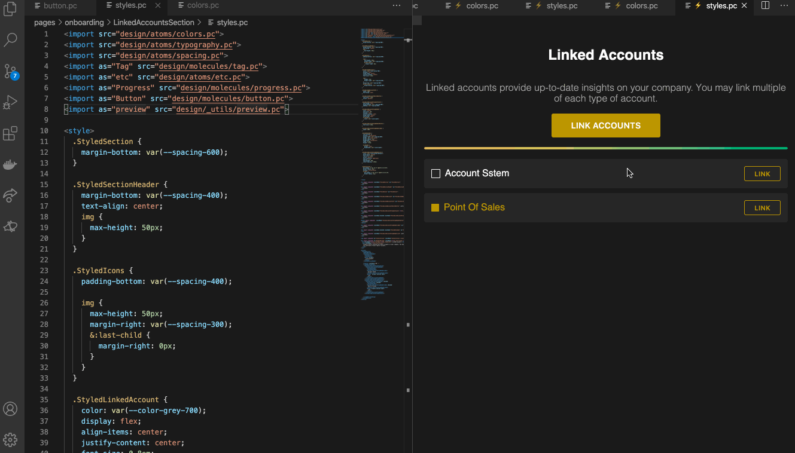

Paperclip is a language for building UI primitives. Here's an Example:

```html

<!-- Styles are scoped to this document  -->
<style> 
  .button {
    font-family: Helvetica;
    display: inline-block;
    border-radius: 10px;
    padding: 10px 20px;
    color: #FFF;
    background: rgb(51, 51, 51);
    &.secondary {
      color: #333;
      border: 1px solid #333;
      background: transparent;
    }
  }
</style>

<!-- This component is compiled to code -->
<div export component as="Button" class:secondary class="button">
  {children}
</div>

<Button>
  This is a primary button
</Button>

<Button secondary>
  This is a secondary button
</Button>
```

☝🏻 Not much else to this. Here's how you use it in React (using Webpack or CLI tool):

```typescript
import {Button} from "./button.pc";

export SomeForm = () => {
  return <>
    <Button>
      This is a primary button
    </Button>
    <Button secondary>
      This is a secondary button
    </Button>
  </>;
};
```

> ☝🏻 Currently React is the only compiler target, but more are planned. 

## Why use Paperclip?


### Faster development

Paperclip comes with a [realtime preview for VS Code](https://marketplace.visualstudio.com/items?itemName=crcn.paperclip-vscode-extension) that allows you to build UIs in a flash.  ⚡️

<!--  -->


### Visual regression testing

Paperclip encourages you to define previews of _every_ visual state of your UI. Because of that, you automatically get visual regression testing - no setup required. Just run `percy-paperclip` in your Paperclip project.





### Perfect for design systems

Paperclip makes it easy to set up & document design systems that are discoverable, and re-usable. 




### Strongly typed

Paperclip's CLI tool generates TypeScript definition files so that you can safely include Paperclip UIs in your project. Here's an example:

```typescript
/* eslint-disable */
import {ReactNode, ReactElement} from "react";

type Factory<TProps> = (props: TProps) => ReactElement;

export declare const classNames: {
  "app": string,
  "app-container": string,
  "todoapp": string,
  "new-todo": string,
  "toggle-all": string,
  "info": string,
  "todo-list": string,
  "main": string,
};

type Props = {
  onNewTodoKeyPress: Function,
  items: ReactNode,
  controls: ReactNode,
};

declare const View: Factory<Props>;
export default View;
```


## Resources


- [VS Code extension](https://marketplace.visualstudio.com/items?itemName=crcn.paperclip-vscode-extension)
- [Getting started](./documentation/Getting%20Started)
- [Syntax](./documentation/Syntax)
- Integrations
  - [React](./packages/paperclip-compiler-react)
  - [Webpack](./packages/paperclip-loader)
- Examples
  - [React TodoMVC](./examples/react-todomvc)
